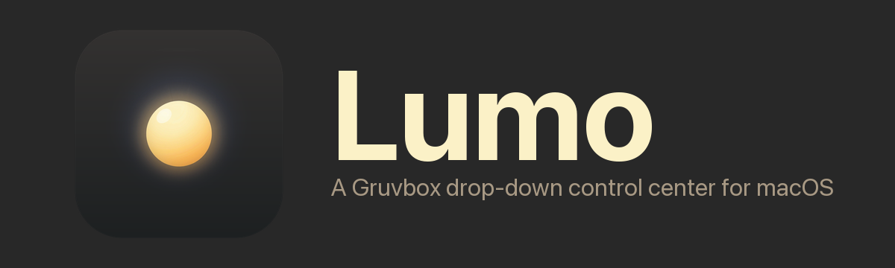
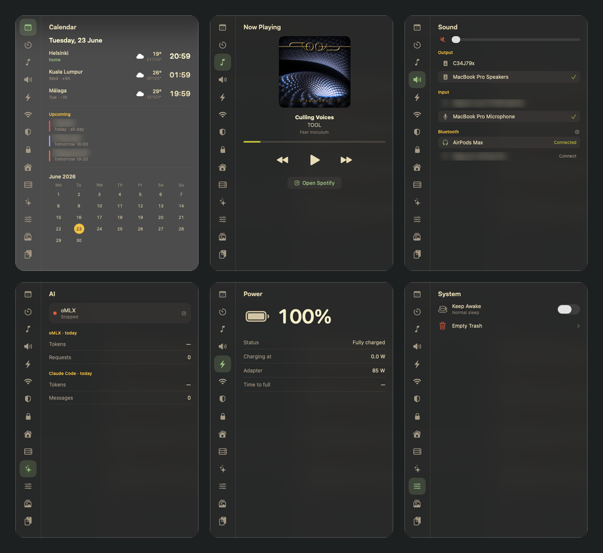

# 🚚 This project has moved — **Lumo is now Kajo**

### → New home: **https://github.com/Mangust1/kajo**

This repository is **archived and no longer maintained**. Lumo was renamed to **Kajo** (to avoid a name clash) and all development continues in the new repo. Please update your bookmarks.

---

<p align="center">
  
</p>

> ⚠️ **100% vibe-coded — use at your own risk.** Built almost entirely by AI pair-programming (Claude Code). No warranty, no guarantees; it may misbehave or eat your config. Read the code before you run it.

A Noctalia-inspired drop-down control center for macOS: **one translucent, Gruvbox-themed window with everything on tabs**, summoned pre-switched to whichever tab you ask for. Pure `swiftc` + a Makefile — **no Xcode**. Runs as an `LSUIElement` agent (no dock icon).

14 tabs. Some work for anyone; some expect the author's home-lab and just show a "No config" hint until you point them at your own services:

- **Universal:** Calendar (world clocks + weather + events), Timer, Now Playing (Spotify), Sound, Power, Network, System, Memes, Clipboard.
- **Needs your own backend (optional):** UniFi, Home (Home Assistant), Pi (a small health container), VPN, AI (a local oMLX server).

> ⚠️ It's a personal tool, not a polished product. It has a **built-in menu-bar icon** (plus `lumo://tab/<name>` URLs) to summon the panel, and reads optional per-module config from `~/.config/lumo/` (see `config-examples/`). Getting it running on a fresh Mac still means building it and sorting out code-signing. The prompt below hands all of that to Claude Code.

## Screenshots

<p align="center">
  
</p>

---

## 🟢 Install it with Claude Code (copy-paste this)

Open this folder in [Claude Code](https://claude.com/claude-code) and paste the prompt below. It tells Claude exactly how to build, sign, launch, and personalize Lumo on **your** Mac — adapting to what you have installed and which services you actually run.

````text
You're helping me install "Lumo", a single-file SwiftUI/AppKit macOS menu-tool
that lives in this repo (Sources/main.swift, built with swiftc via the Makefile —
no Xcode). It's the original author's personal control-center, so part of your job
is to make it work on MY Mac and strip out anything hardwired to them. Read
Sources/main.swift, the Makefile, and Info.plist first, then walk me through this,
asking me before anything that needs my input. Explain trade-offs; don't assume I
have the author's home-lab.

1. PREREQS — verify macOS 14+, that `xcode-select -p` works (Xcode Command Line
   Tools; offer to run `xcode-select --install` if not), and `make`. `blueutil`
   (via Homebrew) is optional, only for Bluetooth connect/disconnect in the Sound tab.

2. CODE SIGNING — the Makefile signs with a cert named "Lumo Self-Signed" that
   exists only in the AUTHOR's keychain. I don't have it, so pick one:
   (a) Recommended: create a fresh self-signed code-signing cert named exactly
       "Lumo Self-Signed" in MY login keychain (openssl → `security import` →
       `security add-trusted-cert -p codeSign`). This keeps macOS privacy
       permissions (TCC) granted across rebuilds.
   (b) Simpler: change the Makefile's SIGN_ID to ad-hoc signing ("-"). Works, but
       I'll have to re-approve permission prompts after each rebuild.
   Set it up, then `make install` (builds + copies to /Applications + registers
   the lumo:// URL scheme). Confirm /Applications/Lumo.app exists.

3. A WAY TO OPEN IT — there is NO built-in menu-bar icon or hotkey; the app is only
   summoned via `lumo://tab/<name>` URLs. Ask me how I want to trigger it and set it
   up:
   - If I run [sketchybar](https://github.com/FelixKratz/SketchyBar): add click_scripts like `open 'lumo://tab/calendar'`.
   - Otherwise, offer me a choice and implement it: a global hotkey (skhd /
     Hammerspoon / Raycast / macOS Shortcuts), OR add a small NSStatusItem menu-bar
     button to Sources/main.swift that toggles the panel (good default for a normal
     user — implement it cleanly if I pick this).

4. PERSONALIZE — in Sources/main.swift, replace the hardcoded `worldCities`
   (currently Helsinki / Kuala Lumpur / Málaga) with MY cities: name, IANA timezone,
   latitude, longitude (weather uses Open-Meteo, no API key). Also update the `home`
   timezone in WorldClocksView. Rebuild + reinstall.

5. CONFIGURE THE OPTIONAL TABS — all live in ~/.config/lumo/*.json (mode 600) and
   are skippable; an unconfigured tab just shows "No config". Ask which of these I
   actually use and set up only those:
   - UniFi  → unifi.json {host, username, password, site}  (local UniFi account)
   - Home   → ha.json {url, token, entities:[...]}          (Home Assistant)
   - Pi     → pi.json {local:"http://<my-pi-ip>:9099/health"}  (needs the
              lumo-health container running on my Pi — only if the author shared
              that folder too).
   - AI     → expects a local oMLX server at 127.0.0.1:8000.
   IMPORTANT: any `remote` / CloudFront / S3 / token values you see in examples or
   in a pi.json point at the AUTHOR's personal AWS account — DO NOT reuse them. Omit
   `remote` entirely unless I provision my own.

6. FIRST-RUN PERMISSIONS — tell me to approve the macOS prompts as I open tabs:
   Bluetooth, Location (for Wi-Fi scanning), Calendar (Upcoming events), and
   Automation/Spotify (Now Playing). The Network tab's "Wi-Fi priority" toggle needs
   a sudoers rule (/etc/sudoers.d/lumo-networksetup) — only add it if I want the
   silent toggle; otherwise leave it out.

7. OPTIONAL always-on — offer to create a LaunchAgent
   (~/Library/LaunchAgents/<id>.plist, RunAtLoad) pointing at
   /Applications/Lumo.app. Not required — opening a lumo:// URL launches it on demand.

8. VERIFY — open each universal tab (`open lumo://tab/calendar`, etc.), confirm the
   app stays alive, and tell me plainly which tabs are empty and why.
````

---

## Manual quickstart (if you'd rather not use Claude)

```sh
# 1. build (see signing note below) and install
make install

# 2. summon a tab
open "lumo://tab/calendar"      # or music, sound, power, network, timer, system…
```

- **Signing:** the Makefile signs with `SIGN_ID := Lumo Self-Signed`. Create your own cert by that name, or set `SIGN_ID := -` for ad-hoc signing.
- **Open it:** wire `open 'lumo://tab/<name>'` to a hotkey, a [sketchybar](https://github.com/FelixKratz/SketchyBar) item, or add a menu-bar button. Re-firing the same tab toggles it closed; click outside or press `Esc` to dismiss.
- **Personalize:** edit `worldCities` and the home timezone in `Sources/main.swift`.
- **Optional configs:** `~/.config/lumo/{unifi,ha,pi}.json` (mode 600). Absent = that tab shows "No config".

## Status

v0.21 — 12 working tabs, quake-style slide animation, code-signed (TCC persists), UniFi/Network/Pi cached for instant open.
